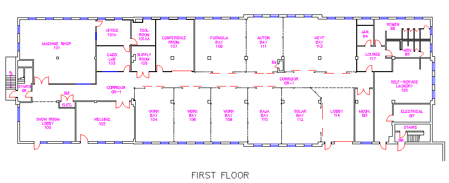

[Home](https://nmstamps.github.io/WareLab/) | [Maps](map.md) | [Acronyms](acronyms.md) | [Ware Lab (official)](https://eng.vt.edu/warelab.html)

# Where is the Ware Lab?

The Ware Lab doesn't actually have it's own building, it shares one with VT Rescue services, and several services for the Core of Cadets.

That being said, the Ware Lab is located in the "Military Building" near Turner's.

The address is

>404 Old Turner St,
>Blacksburg, VA 24060
>Blacksburg, VA 24061

*This address is actually different from that of the Military Building, but this is the building that the Ware Lab is in*

# Ware Lab maps

This is a page of Ware Lab maps

